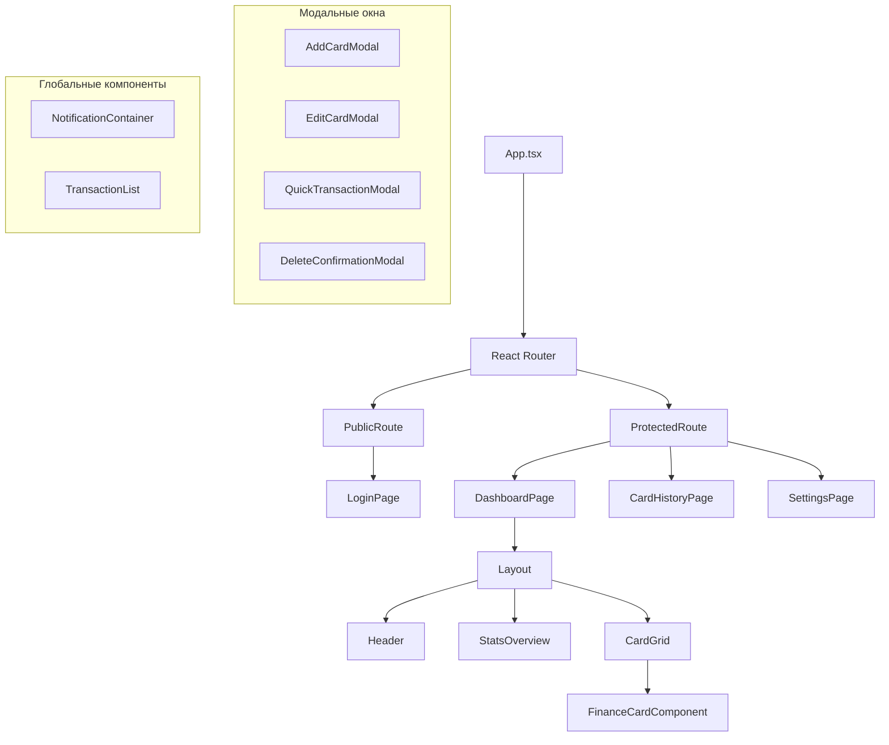
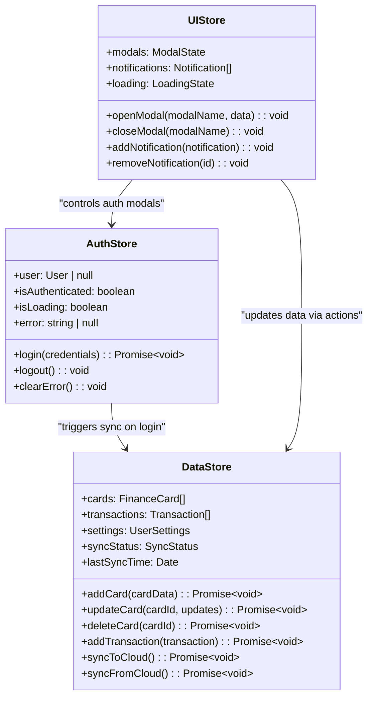

# Дизайн веб-приложения для учёта личных финансов

## Обзор проекта

### Описание

Веб-приложение Balance представляет собой современный SPA (Single Page Application) для управления личными финансами, разработанный с использованием React и TypeScript. Приложение обеспечивает полнофункциональное управление финансовыми карточками и транзакциями с синхронизацией данных через GitHub Gist API.

### Ключевые характеристики

- Адаптивный интерфейс для ПК, планшетов и смартфонов
- Тёмная тема с приятными пастельными цветами
- Клиентское хранение данных с облачной синхронизацией
- Простая авторизация без серверной части
- Кросс-платформенная доступность

### Основные возможности

- Управление финансовыми карточками (создание, редактирование, удаление)
- Отслеживание транзакций (доходы и расходы)
- Облачная синхронизация через GitHub Gist API
- Демо-авторизация для быстрого доступа
- История операций по каждой карточке

## Технологический стек и зависимости

### Основные технологии

- **Frontend Framework**: React 19.1.1 с TypeScript 5.8.3
- **Build Tool**: Vite 7.1.2
- **Styling**: Tailwind CSS 4.1.12 с PostCSS 8.5.6
- **State Management**: Zustand 5.0.8
- **Routing**: React Router DOM 7.8.2
- **HTTP Client**: Axios 1.11.0
- **Icons**: Lucide React 0.542.0

### Инструменты разработки

- **Linting**: ESLint 9.33.0
- **Code Formatting**: Prettier 3.6.2
- **TypeScript Configuration**: Модульная структура с project references

### Требования к окружению

- Node.js >= 18.0.0
- npm >= 8.0.0
- Современный браузер с поддержкой ES2020+

## Архитектура компонентов

### Иерархия компонентов



### Определение компонентов

#### Основные страницы

**LoginPage**

- Компонент авторизации с фиксированными учётными данными
- Интеграция с authStore для управления состоянием входа
- Редирект на главную страницу после успешной авторизации

**DashboardPage**

- Главная страница приложения после авторизации
- Отображение статистики и сетки финансовых карточек
- Кнопка добавления новых карточек
- Обработка пустого состояния для новых пользователей

**CardHistoryPage**

- Детальная история транзакций для выбранной карточки
- Фильтрация и сортировка операций
- Возможность добавления новых транзакций

**SettingsPage**

- Управление настройками приложения
- Синхронизация с GitHub Gist
- Экспорт/импорт данных

#### UI компоненты

**FinanceCardComponent**

```typescript
interface FinanceCardComponentProps {
  card: FinanceCard;
  onEdit: (cardId: string) => void;
  onDelete: (cardId: string) => void;
  onQuickTransaction: (cardId: string) => void;
  onViewHistory: (cardId: string) => void;
}
```

**CardGrid**

- Адаптивная сетка для отображения финансовых карточек
- Обработка различных размеров экрана
- Пустое состояние при отсутствии карточек

**StatsOverview**

- Общая статистика по всем карточкам
- Итоговый баланс и сумма последних операций
- Графические индикаторы доходов/расходов

#### Модальные компоненты формы

**AddCardModal**

- Форма создания новой финансовой карточки
- Валидация полей и выбор цвета
- Интеграция с dataStore

**EditCardModal**

- Редактирование существующей карточки
- Предзаполнение данных
- Валидация изменений

**QuickTransactionModal**

- Быстрое добавление транзакции
- Выбор типа операции (доход/расход)
- Автоматическое обновление баланса

#### Компоненты аутентификации

**ProtectedRoute**

- Защищённый маршрут для авторизованных пользователей
- Редирект на страницу входа при отсутствии авторизации
- Интеграция с authStore

**PublicRoute**

- Публичный маршрут для неавторизованных пользователей
- Редирект на главную страницу при наличии авторизации

### Пример использования компонентов

```typescript
// Использование FinanceCardComponent в CardGrid
<div className="grid grid-cols-1 md:grid-cols-2 lg:grid-cols-3 gap-6">
  {cards.map((card) => (
    <FinanceCardComponent
      key={card.id}
      card={card}
      onEdit={handleEditCard}
      onDelete={handleDeleteCard}
      onQuickTransaction={handleQuickTransaction}
      onViewHistory={handleViewHistory}
    />
  ))}
</div>
```

## Маршрутизация и навигация

### Структура маршрутов

```typescript
// Основная структура маршрутизации
<Router>
  <Routes>
    <Route
      path="/login"
      element={
        <PublicRoute>
          <LoginPage />
        </PublicRoute>
      }
    />

    <Route
      path="/"
      element={
        <ProtectedRoute>
          <Layout>
            <DashboardPage />
          </Layout>
        </ProtectedRoute>
      }
    />

    <Route
      path="/card-history/:cardId"
      element={
        <ProtectedRoute>
          <Layout>
            <CardHistoryPage />
          </Layout>
        </ProtectedRoute>
      }
    />

    <Route
      path="/settings"
      element={
        <ProtectedRoute>
          <Layout>
            <SettingsPage />
          </Layout>
        </ProtectedRoute>
      }
    />
  </Routes>
</Router>
```

### Навигационные паттерны

**Программная навигация**

- Использование `useNavigate` для редиректов
- Передача состояния между страницами
- Обработка параметров маршрута

**Защищённые маршруты**

- Проверка статуса авторизации
- Автоматический редирект на страницу входа
- Сохранение intended URL для возврата после авторизации

## Стратегия стилизации

### Tailwind CSS конфигурация

```typescript
// tailwind.config.js
module.exports = {
  darkMode: "class",
  theme: {
    extend: {
      colors: {
        // Пастельные цвета для карточек
        "card-blue": "#E3F2FD",
        "card-green": "#E8F5E8",
        "card-purple": "#F3E5F5",
        "card-orange": "#FFF3E0",

        // Тёмная тема
        "dark-bg": "#121212",
        "dark-surface": "#1E1E1E",
        "dark-text": "#E0E0E0",
      },
      spacing: {
        "18": "4.5rem",
        "88": "22rem",
      },
    },
  },
};
```

### Адаптивный дизайн

**Брейкпоинты**

- `sm`: 640px (мобильные устройства)
- `md`: 768px (планшеты)
- `lg`: 1024px (ноутбуки)
- `xl`: 1280px (десктопы)

**Компонентная адаптивность**

```css
/* Сетка карточек */
.card-grid {
  @apply grid grid-cols-1 md:grid-cols-2 lg:grid-cols-3 xl:grid-cols-4 gap-4;
}

/* Адаптивная типографика */
.heading {
  @apply text-xl md:text-2xl lg:text-3xl font-bold;
}
```

### CSS-in-JS альтернативы

- Использование CSS модулей для изолированных стилей
- Styled-components как альтернатива для сложных компонентов
- CSS Custom Properties для динамических цветов карточек

## Управление состоянием

### Архитектура Zustand Store



### Состояние аутентификации (AuthStore)

```typescript
interface AuthState {
  user: User | null;
  isAuthenticated: boolean;
  isLoading: boolean;
  error: string | null;
}

interface AuthActions {
  login: (credentials: LoginCredentials) => Promise<void>;
  logout: () => void;
  clearError: () => void;
}

// Упрощённая авторизация с фиксированными учётными данными
const useAuthStore = create<AuthState & AuthActions>(
  persist(
    (set, get) => ({
      user: null,
      isAuthenticated: false,
      isLoading: false,
      error: null,

      login: async (credentials) => {
        set({ isLoading: true, error: null });
        try {
          // Проверка фиксированных учётных данных
          if (
            credentials.username === "user" &&
            credentials.password === "pass"
          ) {
            const user = { id: "1", username: credentials.username };
            set({ user, isAuthenticated: true, isLoading: false });
          } else {
            throw new Error("Неверные учётные данные");
          }
        } catch (error) {
          set({ error: String(error), isLoading: false });
        }
      },

      logout: () => {
        set({ user: null, isAuthenticated: false });
      },
    }),
    { name: "auth-storage" }
  )
);
```

### Управление данными (DataStore)

```typescript
interface DataState {
  cards: FinanceCard[];
  transactions: Transaction[];
  settings: UserSettings;
  syncStatus: "idle" | "syncing" | "success" | "error";
  lastSyncTime: Date | null;
  isLoading: boolean;
  error: string | null;
}

interface DataActions {
  // Управление карточками
  addCard: (cardData: Omit<FinanceCard, "id">) => Promise<void>;
  updateCard: (cardId: string, updates: Partial<FinanceCard>) => Promise<void>;
  deleteCard: (cardId: string) => Promise<void>;

  // Управление транзакциями
  addTransaction: (transaction: Omit<Transaction, "id">) => Promise<void>;
  updateTransaction: (
    transactionId: string,
    updates: Partial<Transaction>
  ) => Promise<void>;
  deleteTransaction: (transactionId: string) => Promise<void>;

  // Синхронизация
  syncToCloud: () => Promise<void>;
  syncFromCloud: () => Promise<void>;

  // Утилитарные методы
  calculateCardBalance: (cardId: string) => number;
  getTotalBalance: () => number;
  getTransactionsByCard: (cardId: string) => Transaction[];
}
```

### UI состояние (UIStore)

```typescript
interface UIState {
  modals: {
    addCard: boolean;
    editCard: { isOpen: boolean; cardId?: string };
    quickTransaction: { isOpen: boolean; cardId?: string };
    deleteConfirmation: { isOpen: boolean; cardId?: string };
  };
  notifications: Notification[];
  loading: {
    global: boolean;
    cardActions: boolean;
    sync: boolean;
  };
}

interface UIActions {
  openModal: (modalName: keyof UIState["modals"], data?: any) => void;
  closeModal: (modalName: keyof UIState["modals"]) => void;
  addNotification: (notification: Omit<Notification, "id">) => void;
  removeNotification: (id: string) => void;
  setLoading: (type: keyof UIState["loading"], state: boolean) => void;
}
```

## Слой интеграции с API

### GitHub Gist Service

```typescript
class GitHubGistService {
  private token: string;
  private gistId?: string;

  constructor(token: string, gistId?: string) {
    this.token = token;
    this.gistId = gistId;
  }

  // Сохранение данных в Gist
  async saveAppData(data: AppData): Promise<string> {
    const gistData = {
      files: {
        "balance-data.json": {
          content: JSON.stringify(data, null, 2),
        },
      },
      description: "Balance App Data Backup",
      public: false,
    };

    try {
      if (this.gistId) {
        // Обновление существующего Gist
        const response = await axios.patch(
          `https://api.github.com/gists/${this.gistId}`,
          gistData,
          { headers: { Authorization: `token ${this.token}` } }
        );
        return response.data.id;
      } else {
        // Создание нового Gist
        const response = await axios.post(
          "https://api.github.com/gists",
          gistData,
          { headers: { Authorization: `token ${this.token}` } }
        );
        this.gistId = response.data.id;
        return response.data.id;
      }
    } catch (error) {
      throw new Error(`Ошибка сохранения данных: ${String(error)}`);
    }
  }

  // Загрузка данных из Gist
  async loadAppData(): Promise<AppData> {
    if (!this.gistId) {
      throw new Error("Gist ID не установлен");
    }

    try {
      const response = await axios.get(
        `https://api.github.com/gists/${this.gistId}`,
        { headers: { Authorization: `token ${this.token}` } }
      );

      const fileContent = response.data.files["balance-data.json"]?.content;
      if (!fileContent) {
        throw new Error("Файл данных не найден в Gist");
      }

      return JSON.parse(fileContent);
    } catch (error) {
      throw new Error(`Ошибка загрузки данных: ${String(error)}`);
    }
  }

  // Синхронизация данных с разрешением конфликтов
  async syncData(localData: AppData): Promise<AppData> {
    try {
      const cloudData = await this.loadAppData();

      // Простая стратегия разрешения конфликтов: приоритет более новым данным
      if (cloudData.metadata.lastModified > localData.metadata.lastModified) {
        return cloudData;
      } else {
        await this.saveAppData(localData);
        return localData;
      }
    } catch (error) {
      // Если данных в облаке нет, сохраняем локальные
      await this.saveAppData(localData);
      return localData;
    }
  }
}
```

### Интеграция API в DataStore

```typescript
const useDataStore = create<DataState & DataActions>(
  persist(
    (set, get) => ({
      // ... состояние

      syncToCloud: async () => {
        const state = get();
        set({ syncStatus: "syncing" });

        try {
          const appData: AppData = {
            cards: state.cards,
            transactions: state.transactions,
            settings: state.settings,
            metadata: {
              version: "1.0.0",
              lastModified: new Date().toISOString(),
              source: "client",
            },
          };

          const gistService = new GitHubGistService(
            state.settings.githubToken,
            state.settings.gistId
          );

          const gistId = await gistService.saveAppData(appData);

          set({
            syncStatus: "success",
            lastSyncTime: new Date(),
            settings: { ...state.settings, gistId },
          });
        } catch (error) {
          set({ syncStatus: "error", error: String(error) });
        }
      },

      syncFromCloud: async () => {
        const state = get();
        set({ syncStatus: "syncing" });

        try {
          const gistService = new GitHubGistService(
            state.settings.githubToken,
            state.settings.gistId
          );

          const cloudData = await gistService.loadAppData();

          set({
            cards: cloudData.cards,
            transactions: cloudData.transactions,
            settings: { ...state.settings, ...cloudData.settings },
            syncStatus: "success",
            lastSyncTime: new Date(),
          });
        } catch (error) {
          set({ syncStatus: "error", error: String(error) });
        }
      },
    }),
    {
      name: "finance-data-storage",
      partialize: (state) => ({
        cards: state.cards,
        transactions: state.transactions,
        settings: state.settings,
        lastSyncTime: state.lastSyncTime,
      }),
    }
  )
);
```

## Стратегия тестирования

### Unit тестирование

**Тестирование Zustand Store**

```typescript
// __tests__/stores/dataStore.test.ts
import { renderHook, act } from "@testing-library/react";
import { useDataStore } from "../src/stores/dataStore";

describe("DataStore", () => {
  beforeEach(() => {
    useDataStore.getState().clearStore();
  });

  test("должен добавлять новую карточку", async () => {
    const { result } = renderHook(() => useDataStore());

    const newCard = {
      name: "Тестовая карта",
      color: "#E3F2FD",
      initialBalance: 1000,
    };

    await act(async () => {
      await result.current.addCard(newCard);
    });

    expect(result.current.cards).toHaveLength(1);
    expect(result.current.cards[0].name).toBe("Тестовая карта");
  });

  test("должен корректно рассчитывать баланс карточки", () => {
    const { result } = renderHook(() => useDataStore());

    // Добавляем карточку и транзакции
    const cardId = "test-card-id";
    act(() => {
      result.current.addCard({
        id: cardId,
        name: "Test",
        initialBalance: 1000,
      });
      result.current.addTransaction({
        cardId,
        amount: 500,
        type: "income",
        description: "Доход",
      });
      result.current.addTransaction({
        cardId,
        amount: 200,
        type: "expense",
        description: "Расход",
      });
    });

    const balance = result.current.calculateCardBalance(cardId);
    expect(balance).toBe(1300); // 1000 + 500 - 200
  });
});
```

**Тестирование компонентов**

```typescript
// __tests__/components/FinanceCardComponent.test.tsx
import { render, screen, fireEvent } from "@testing-library/react";
import { FinanceCardComponent } from "../src/components/ui/FinanceCardComponent";

const mockCard = {
  id: "1",
  name: "Тестовая карта",
  color: "#E3F2FD",
  initialBalance: 1000,
  createdAt: new Date().toISOString(),
};

describe("FinanceCardComponent", () => {
  test("отображает информацию о карточке", () => {
    render(
      <FinanceCardComponent
        card={mockCard}
        onEdit={jest.fn()}
        onDelete={jest.fn()}
        onQuickTransaction={jest.fn()}
        onViewHistory={jest.fn()}
      />
    );

    expect(screen.getByText("Тестовая карта")).toBeInTheDocument();
    expect(screen.getByText("1 000 ₽")).toBeInTheDocument();
  });

  test("вызывает onEdit при клике на кнопку редактирования", () => {
    const onEdit = jest.fn();

    render(
      <FinanceCardComponent
        card={mockCard}
        onEdit={onEdit}
        onDelete={jest.fn()}
        onQuickTransaction={jest.fn()}
        onViewHistory={jest.fn()}
      />
    );

    fireEvent.click(screen.getByLabelText("Редактировать карточку"));
    expect(onEdit).toHaveBeenCalledWith("1");
  });
});
```

### Integration тестирование

**Тестирование GitHub Gist Service**

```typescript
// __tests__/services/GitHubGistService.test.ts
import { GitHubGistService } from "../src/services/GitHubGistService";
import axios from "axios";

jest.mock("axios");
const mockedAxios = axios as jest.Mocked<typeof axios>;

describe("GitHubGistService", () => {
  const mockToken = "test-token";
  const mockGistId = "test-gist-id";

  beforeEach(() => {
    jest.clearAllMocks();
  });

  test("должен сохранять данные в новый Gist", async () => {
    const service = new GitHubGistService(mockToken);
    const testData = {
      cards: [],
      transactions: [],
      settings: {},
      metadata: { version: "1.0.0", lastModified: new Date().toISOString() },
    };

    mockedAxios.post.mockResolvedValueOnce({
      data: { id: "new-gist-id" },
    });

    const gistId = await service.saveAppData(testData);

    expect(mockedAxios.post).toHaveBeenCalledWith(
      "https://api.github.com/gists",
      expect.objectContaining({
        files: {
          "balance-data.json": {
            content: JSON.stringify(testData, null, 2),
          },
        },
      }),
      { headers: { Authorization: `token ${mockToken}` } }
    );

    expect(gistId).toBe("new-gist-id");
  });
});
```

### E2E тестирование

**Cypress тесты для критических пользовательских сценариев**

```typescript
// cypress/e2e/user-flow.cy.ts
describe("Основные пользовательские сценарии", () => {
  beforeEach(() => {
    cy.visit("/");
  });

  it("должен позволить пользователю войти и добавить карточку", () => {
    // Авторизация
    cy.get('[data-testid="username-input"]').type("user");
    cy.get('[data-testid="password-input"]').type("pass");
    cy.get('[data-testid="login-button"]').click();

    // Переход на главную страницу
    cy.url().should("eq", Cypress.config().baseUrl + "/");

    // Добавление новой карточки
    cy.get('[data-testid="add-card-button"]').click();
    cy.get('[data-testid="card-name-input"]').type("Моя карта");
    cy.get('[data-testid="card-color-picker"]').click();
    cy.get('[data-color="#E3F2FD"]').click();
    cy.get('[data-testid="initial-balance-input"]').type("5000");
    cy.get('[data-testid="save-card-button"]').click();

    // Проверка, что карточка появилась
    cy.get('[data-testid="card-grid"]').should("contain", "Моя карта");
    cy.get('[data-testid="card-balance"]').should("contain", "5 000 ₽");
  });

  it("должен позволить добавить транзакцию", () => {
    // Предварительная настройка: авторизация и создание карточки
    cy.login();
    cy.createCard("Тестовая карта", "#E8F5E8", 1000);

    // Добавление транзакции
    cy.get('[data-testid="quick-transaction-button"]').first().click();
    cy.get('[data-testid="transaction-amount-input"]').type("500");
    cy.get('[data-testid="transaction-type-income"]').click();
    cy.get('[data-testid="transaction-description-input"]').type("Зарплата");
    cy.get('[data-testid="save-transaction-button"]').click();

    // Проверка обновления баланса
    cy.get('[data-testid="card-balance"]').should("contain", "1 500 ₽");
  });
});
```

## Определения типов

### Основные интерфейсы

```typescript
// src/types/index.ts

export interface FinanceCard {
  id: string;
  name: string;
  color: string;
  initialBalance: number;
  createdAt: string;
  updatedAt: string;
}

export interface Transaction {
  id: string;
  cardId: string;
  amount: number;
  type: "income" | "expense";
  description: string;
  category?: string;
  date: string;
  createdAt: string;
}

export interface User {
  id: string;
  username: string;
}

export interface UserSettings {
  theme: "light" | "dark";
  currency: string;
  githubToken?: string;
  gistId?: string;
  autoSync: boolean;
  notifications: {
    enabled: boolean;
    syncSuccess: boolean;
    syncError: boolean;
  };
}

export interface AppData {
  cards: FinanceCard[];
  transactions: Transaction[];
  settings: UserSettings;
  metadata: {
    version: string;
    lastModified: string;
    source: "client" | "cloud";
  };
}

export interface LoginCredentials {
  username: string;
  password: string;
}

export interface Notification {
  id: string;
  type: "success" | "error" | "warning" | "info";
  title: string;
  message: string;
  duration?: number;
  createdAt: string;
}

export interface ModalState {
  isOpen: boolean;
  data?: any;
}

export type SyncStatus = "idle" | "syncing" | "success" | "error";

export type LoadingState = {
  [key: string]: boolean;
};
```

### Утилитарные типы

```typescript
// Типы для форм
export type CardFormData = Omit<FinanceCard, "id" | "createdAt" | "updatedAt">;
export type TransactionFormData = Omit<Transaction, "id" | "createdAt">;

// Типы для API ответов
export interface GitHubGistResponse {
  id: string;
  files: {
    [filename: string]: {
      content: string;
    };
  };
  created_at: string;
  updated_at: string;
}

// Типы для состояния загрузки
export interface AsyncState<T> {
  data: T | null;
  loading: boolean;
  error: string | null;
}

// Типы для валидации
export interface ValidationError {
  field: string;
  message: string;
}

export interface FormValidation {
  isValid: boolean;
  errors: ValidationError[];
}
```
